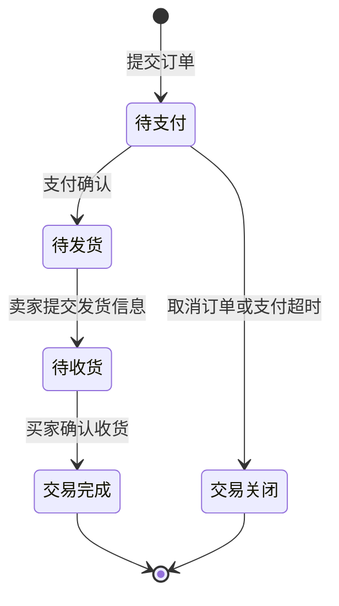

# Globuy 产品需求文档

> 面向海外留学生的二手物品交易平台，围绕找货、发布、沟通和订单跟进设计完整交易流程。

| 项目 | 内容 |
| --- | --- |
| 文档版本 | V1.0 |
| 更新日期 | 2026-09-16 |
| 文档性质 | 基于已完成毕业设计整理的产品需求文档，用于产品岗位项目展示 |
| 产品形态 | Web 用户端与管理员后台 |
| 当前状态 | 已有前后端项目与 GitHub Pages 静态演示；未将演示作为真实收款交易平台上线 |
| 阅读入口 | [在线体验](https://liangjixuan3-svg.github.io/Globuy/) · [项目说明](../README.md) |

本文不是项目开发前的历史 PRD，也不声称已开展真实用户访谈、商业运营或量化增长实验。已有规则以当前代码为准；产品判断、拟定目标和后续改进均单独标注。公开演示的商品、用户、地址、订单与聊天记录均为虚构数据，不作为需求研究样本。

## 目录

- [产品概览](#产品概览)
- [目标用户与待验证问题](#目标用户与待验证问题)
- [产品目标与范围](#产品目标与范围)
- [需求优先级与取舍](#需求优先级与取舍)
- [角色与页面结构](#角色与页面结构)
- [核心业务流程](#核心业务流程)
- [详细需求](#详细需求)
- [异常处理与验收](#异常处理与验收)
- [指标与验证方案](#指标与验证方案)
- [非功能需求与发布条件](#非功能需求与发布条件)
- [迭代规划](#迭代规划)
- [参考依据与实现索引](#参考依据与实现索引)

## 产品概览

Globuy 希望帮助留学生在入学、搬家和毕业回国时买到或转让二手物品。设计重点是把分散的信息整理成可搜索的商品，并用站内沟通和订单状态记录后续进展。

| 用户任务 | 产品处理方式 | 需要验证的价值 |
| --- | --- | --- |
| 在有限预算下找到合适的物品 | 分类、关键词、国家或地区筛选及价格排序 | 是否减少寻找可交易物品的时间 |
| 快速描述并发布闲置物品 | 结构化发布表单、实拍图、AI 描述与价格建议 | 是否降低发布耗时，同时保持信息真实完整 |
| 判断陌生卖家的商品是否值得联系 | 商品成色、详情、卖家学校信息与历史评价 | 是否帮助判断交易对象，而不是制造安全保证 |
| 避免约定后忘记交易进度 | 待支付、待发货、待收货、交易完成与关闭状态 | 是否减少无效占用及重复沟通 |
| 理解不熟悉的货币金额 | 多币种展示与统一价格基准 | 是否减少价格理解错误 |

产品定位是服务留学生场景的二手信息与交易流程工具。多国家或地区支持用于描述商品所在地，不等于已经解决跨国物流、跨境收款或国际纠纷。

## 目标用户与待验证问题

### 场景画像

以下是用于设计的情境画像，不是真实受访者档案。

| 用户 | 触发场景 | 核心任务 | 主要阻力 | 对应设计 |
| --- | --- | --- | --- | --- |
| 初到海外的新生 | 入学前后需要置办生活用品 | 在预算内找到能交付的商品 | 不熟悉当地价格，商品信息难筛选 | 搜索、所在地筛选、价格换算与详情 |
| 毕业或搬家的卖家 | 物品不便携带，处理时间有限 | 发布闲置并跟进买家 | 文案组织费时，重复回答问题 | 多图和结构化信息、AI 辅助、聊天与订单 |
| 在校买卖双方 | 日常更换教材、电子产品等 | 核实成色并安排交付 | 对陌生交易对象了解有限 | 学校信息、评价、站内沟通 |
| 平台管理员 | 维护内容与基础数据 | 找到并处理异常信息 | 商品、账号与订单分散 | 管理后台与基础统计 |

### 假设与验证计划

参考报告提出了信息分散、交易沟通和身份信任等问题，但未提供足以复核的用户样本及原始调研记录，因此本文将其作为待验证假设。

| 假设 ID | 假设 | 拟采用的验证方法 | 决策影响 |
| --- | --- | --- | --- |
| H01 | 找不到所在地合适的商品，比缺少推荐算法更影响买家体验 | 访谈并观察新生完成一次指定品类搜索，记录卡点和用时 | 确定地区筛选与推荐优化的先后顺序 |
| H02 | 卖家放弃发布的主要原因之一是描述与定价困难 | 观察卖家完成发布，记录各字段耗时、放弃点与修改次数 | 决定 AI 助手是否值得继续投入 |
| H03 | 学校信息与评价能辅助联系决策，但不能代替验货 | 让用户比较不同详情页并解释联系理由 | 调整信任信息的位置与说明文案 |
| H04 | 短时保留商品能减少重复购买，但 5 分钟可能不适合所有二手场景 | 记录未支付原因，区分临时退出、仍在协商和无意购买 | 决定是否调整支付时限或增加预约机制 |

拟先招募买家和卖家各 5 名开展探索访谈，邀请其中用户做任务观察。该样本只用于发现问题，不用于推算整个留学生市场的比例。不能仅用“你愿不愿意使用”判断需求，应追问最近一次交易、实际做法、耗时和失败原因。

## 产品目标与范围

### 目标

本阶段的产品目标是让用户能完成“发现商品 → 判断与沟通 → 下单 → 跟进交付 → 评价”的流程，并让卖家能够发布、管理和交付自己的商品。

项目展示的成功标准是规则清楚、页面与需求一致、演示不依赖本机服务，并且能解释设计取舍。真实试点的成功标准需要在获得用户基线后再确定，不能用虚构订单量证明产品有效。

### 范围边界

| 本版已有功能范围 | 不作为本版已交付能力 |
| --- | --- |
| 注册登录、个人信息、商品发布与管理 | 真实身份实名审核、可靠邮箱所有权验证 |
| 首页、搜索、分类、国家或地区筛选、详情、收藏 | 个性化推荐算法、精确距离排序或地图撮合 |
| 多币种价格展示 | 多币种真实结算、汇率锁价或换汇服务 |
| 订单状态、发货信息、收货、买家评价 | 真实支付回调、资金托管、退款售后和争议仲裁 |
| 原后端 WebSocket 聊天及记录管理 | 在线静态演示中的真实双端聊天 |
| AI 发布辅助与管理后台 | AI 自动审核、商品真伪鉴定、商业经营分析系统 |

GitHub 演示保留原界面和原虚构业务内容。它使用浏览器内存模拟业务接口，刷新后恢复数据；支付不收款，聊天不连接真实 WebSocket，AI、邮箱认证、注册、改密和上传不连接真实服务。功能存在于原项目与功能可在静态演示中真实调用，是两种不同状态。

## 需求优先级与取舍

P0 表示交易流程不可缺少或真实上线必须解决的事项；P1 表示能够改善效率和判断质量的事项；P2 表示需更多证据后投入。下表是本次梳理的产品优先级，不追溯为历史开发排期。

| ID | 需求 | 优先级 | 原因 | 当前情况 |
| --- | --- | --- | --- | --- |
| R01 | 商品发现与所在地筛选 | P0 | 没有可交易的商品，后续流程无法成立 | 已有首页、搜索和筛选 |
| R02 | 完整商品信息与发布管理 | P0 | 信息不完整会增加沟通与误购 | 已有表单与管理，需要补强后端校验 |
| R03 | 下单、短时保留与订单流转 | P0 | 需要明确交易进度与物品占用 | 已有状态与超时任务，并发及状态校验待补 |
| R04 | 站内沟通 | P0 | 二手商品通常需要核实成色和交付方式 | 原项目已有聊天，演示本地模拟 |
| R05 | 账号、角色及对象权限 | P0 | 防止查看或修改他人的地址、订单和聊天 | 已有登录机制，需完成对象级权限验收 |
| R06 | 收藏与买家评价 | P1 | 支持暂存购买意向及事后反馈 | 已有 |
| R07 | 多币种展示 | P1 | 帮助留学生理解金额 | 已有，汇率失效提示与结算口径待完善 |
| R08 | 学校认证信息 | P1 | 提供判断线索 | 已有标识和 `.edu` 后缀校验，所有权验证待补 |
| R09 | AI 描述和价格建议 | P1 | 降低发布阻力，但不是交易前提 | 原项目已有，演示不调用模型 |
| R10 | 分类、公告、轮播与管理统计 | P1 | 支撑基础运营和内容维护 | 已有后台 |
| R11 | 个性化推荐、距离排序、订阅提醒 | P2 | 依赖足够的真实供给、行为数据和需求证据 | 后续探索 |

### 关键取舍

1. 先确保搜索、详情和交易流程，再优化推荐。当前按浏览量取首页热门商品，解释简单、维护成本低；代价是新发布商品容易缺少曝光。先观察搜索失败和新商品曝光，再决定加入新上架区域或探索性曝光。
2. 首页保留最多 12 件精选商品和 4 个热门分类，避免把全部库存堆在首屏。“查看全部”承担继续浏览入口。页面布局数量是明确规则，不能因静态演示方便而扩大。
3. 保留既有 5 分钟支付时限，不在文档整理时改变代码。它有助于释放临时占用，但是否适合需要沟通的二手交易仍需验证。
4. AI 作为可选助手，用户必须能够手动发布。生成结果可编辑，不自动承诺商品品质，不将建议价包装成成交价或市场公允价。
5. 用静态演示降低面试查看成本，不把真实数据库或业务密钥暴露到前端。代价是无法演示真实跨用户消息和支付，应在入口明确说明。

## 角色与页面结构

普通用户可以同时作为买家和卖家，无需注册两种账号。管理员负责平台管理；后台角色不代表已具有无限制修改交易事实的产品授权。

```text
用户端
├── 首页：公告、分类、轮播、热门分类、精选商品
├── 搜索列表：关键词、类别、国家或地区、排序、分页
├── 商品详情：图片、价格、成色、描述、卖家、收藏、联系、购买
├── 发布与我的商品：新增、编辑、管理
├── 订单：我买到的、我卖出的、状态筛选、支付、发货、收货、评价
├── 聊天：会话、消息记录、未读处理
└── 个人中心：个人资料、学校信息、收货地址、收藏

管理员端
├── 首页统计
├── 用户、商品、订单管理
└── 分类、公告、轮播管理
```

真实上线的权限目标是“角色权限 + 数据归属 + 当前状态”共同决定操作。例如，买家只能确认自己的待收货订单，卖家只能发货自己的待发货订单，普通用户不能仅通过替换订单 ID 修改别人的交易。这是上线验收要求，不意味着当前所有接口已经满足。

## 核心业务流程

### 买家流程

浏览或搜索商品 → 查看实拍图、价格、成色、所在地和卖家信息 → 按需联系卖家 → 选择自己的收货地址 → 提交订单 → 支付确认 → 等待卖家发货 → 确认收货 → 评价。

联系卖家是可选步骤，不是下单的强制前置条件。下单后保存商品和地址快照，以避免后续修改资料改变当时的交易信息。

### 卖家流程

填写商品信息 → 手动描述或使用 AI 辅助 → 确认价格、图片和交付信息 → 发布商品 → 接收咨询 → 买家下单后商品暂不可再次购买 → 买家支付后填写物流公司和单号 → 等待收货和评价。

当前发货界面依赖物流公司与单号。AI 文案可能提及校内面交，但系统没有独立面交履约流程，不能据此宣称已支持面交核销；面交状态设计列入后续需求验证。

### 订单状态



评价是交易完成后的附加记录，不新增“待评价”订单状态。关闭支付弹窗也不新增状态，不应等同于取消订单。

| 订单状态 | 商品当前存储状态 | 产品含义 |
| --- | --- | --- |
| 尚未产生订单 | 已上架 | 可供发现和购买 |
| 待支付 | 已售出 | 现有实现用“已售出”表示临时保留，并不代表已经支付 |
| 待发货、待收货、交易完成 | 已售出 | 商品继续不可购买 |
| 交易关闭 | 已上架 | 取消或超时后释放商品 |

上线改进建议是区分“锁定中”和“已售出”，减少状态语义混淆；本次不修改现有代码或数据库。

## 详细需求

### R01 商品发现

| 场景 | 已有业务规则 | 产品验收重点 |
| --- | --- | --- |
| 首页精选 | 仅取已上架商品，按浏览量降序，最多 12 件 | 不展示已售出商品，不把全量数据作为精选 |
| 首页热门分类 | 最多 4 个启用热门展示的分类，每类最多 3 件已上架商品，按浏览量降序 | 不额外出现第 5、6 个分类卡片，不侵入下方区域 |
| 分类导航 | 与热门卡片分开，提供全部分类入口 | 全部分类不等于全部都要在热门区域展示 |
| 搜索 | 商品名称关键词匹配，叠加分类和国家或地区字段过滤 | 同时满足各筛选条件，不用所在地文本前缀冒充国家字段 |
| 排序 | 综合按浏览量降序；最新按发布日期降序；价格按统一基准价格升序 | 页面标签与排序结果一致 |
| 分页 | 搜索默认每页 10 件，按查询返回总数分页 | 修改筛选后重置页码，不能保留越界空页 |

当前热门分类接口未显式定义分类排序；不能把返回顺序理解成分类销量排名。浏览量相同商品的稳定次序、空结果提示与筛选重置行为需要纳入上线验收。

### R02 商品发布和详情

| 字段 | 已有规则 | 上线补充要求 |
| --- | --- | --- |
| 主图 | 发布表单必填 | 校验文件类型与大小；上传失败不能显示成功 |
| 名称 | 必填，前端限制 2 至 100 个字符 | 后端重复校验，拒绝全空格 |
| 分类、发布币种 | 必填 | 分类必须有效，币种必须在允许范围内 |
| 售价 | 必填 | 后端校验有限正数、金额范围与小数精度，拒绝负价等异常 |
| 原价 | 可选 | 填写时校验金额，不以原价证明真实折扣 |
| 成色 | 表单默认全新，可调整 | 用户必须确认实际成色，AI 不能代替确认 |
| 描述 | 必填，富文本 | 清理危险 HTML，避免生成未提供的品质和使用经历 |
| 多图 | 可补充 | 明确数量上限、删除和失败重试反馈 |
| 所在地 | 必填，选择地址层级 | 国家或地区存独立字段，完整地点用于展示 |
| 发货方式 | 默认包邮 | 明确其为信息字段，运费计价及面交仍需独立设计 |

新增商品自动归属当前用户，初始状态为已上架，浏览量为 0。详情展示主图、多图、价格、成色、描述及卖家信息，并提供收藏、联系和购买入口。

已售出商品即使通过旧链接访问，也应明确不可购买。编辑或删除商品需要检查归属与关联交易，不能破坏已经形成的订单快照；这些是上线需补强的约束。

### R03 下单与支付时限

下单保存商品名称、主图、卖家、买家、售价和收货地址等交易快照，生成订单编号及创建时间。既有实现立即将商品置为已售出，作为临时占用。

| 用户行为或事件 | 预期反馈与状态 |
| --- | --- |
| 提交有效订单 | 生成待支付订单，展示支付入口 |
| 点击取消支付或关闭支付弹窗 | 保留待支付状态，进入或留在“我买到的”，显示剩余支付时间 |
| 再次打开支付弹窗 | 使用原订单，不重新生成，也不把倒计时重置为 5 分钟 |
| 点击取消订单 | 订单变为交易关闭，商品恢复已上架 |
| 超过创建时间 5 分钟仍未支付 | 自动关闭并释放商品 |
| 支付确认 | 订单变为待发货，不再展示待支付倒计时 |

前端按“创建时间 + 300 秒 − 当前时间”显示 `mm:ss`，每秒更新，归零显示 `00:00` 并触发取消。原后端另有每分钟扫描待支付订单的定时任务，因此关闭页面后也有超时处理机制；任务扫描本身可能带来接近一分钟的延迟。

当前支付接口直接变更订单状态，不校验真实支付凭证；超时、支付和商品释放之间也需要加强原子性与状态条件。真实上线应以服务端截止时间为准，对到期支付做校验，确保支付和取消只允许一个成功，不允许已支付商品被超时任务重新上架。不能依赖客户端倒计时保证资金或库存安全。

### R03 交付与评价

订单页区分“我买到的”和“我卖出的”，支持状态筛选、订单号搜索，默认按订单 ID 倒序。待发货订单由卖家填写物流公司与单号，保存发货时间后进入待收货；待收货订单由买家确认后进入交易完成。

交易完成后买家可填写评分和评价，卖家主页展示已有买家评分与评价记录。当前流程没有真实物流查询、自动收货、退款或争议处理，不能把填写单号解释成物流交付已被验证。

### R04 沟通与 R06 收藏

原项目支持站内单聊、聊天记录、会话列表和未读处理，用户可从商品详情联系卖家。静态演示只模拟本地记录与交互，不用于验证跨浏览器实时收发。

收藏用于保留意向商品，再次点击可取消，收藏夹只显示自己的记录。收藏不锁定库存，也不承诺商品后续仍可购买。上线需验收重复点击、被删除或售出商品、消息发送失败以及用户越权访问聊天等情况。

### R07 多币种价格

数据库以 CNY 为价格基准。发布时用户输入的非 CNY 金额按当时汇率换算为基准金额，原价同样处理；展示时由基准金额乘目标币种汇率，通常保留两位小数。

发布表单目前提供 CNY、USD、GBP、EUR、HKD、JPY 六种币种；展示工具另包含 KRW、CAD、AUD、SGD，不能混称发布与展示拥有完全相同的币种范围。

原项目请求公开汇率接口并缓存一小时，请求失败有固定值兜底；静态演示始终使用固定汇率。这些数值仅帮助理解价格，不代表真实收款结算汇率。上线应展示汇率时间和降级提示，并在订单中固定基准金额与结算口径，避免切换币种改变交易价格。

### R08 学校信息

原接口要求邮箱以 `.edu` 结尾且填写学校，再将当前普通用户标为已认证；未通过验证码或邮件链接确认邮箱所有权。因此现有标识只展示项目中的认证流程，不足以证明真实在校身份。

真实试点前应验证学校邮箱所有权，支持不同国家学校域名，设计认证有效期与撤销流程，并说明学校认证不保证商品质量或交易安全。静态演示不提交真实认证请求。

### R09 AI 发布辅助

描述生成依据商品名称、类别和成色，结果回填富文本区域；用户可继续修改。价格建议参考平台同类别商品价格统计并结合模型输出，异常时存在模板或基础定价回退。这里的统计是平台标价，不是已验证成交行情。

上线需补充明确的生成标识、内容核对和价格币种转换。当前后端参考价格以基准币种统计，而前端按发布币种展示并回填建议，非 CNY 下需防止单位误用。生成内容不得自动添加未证实的“功能正常”“未拆封”或质量保证；失败回退应提示手动补充事实，而不是编造使用情况。

AI 失败不能阻断手动发布，用户选择使用 AI 也不应绕过必填及内容安全校验。静态演示不调用真实模型，不包含业务 API 密钥。

### R10 管理后台

已有用户、商品、订单、分类、公告与轮播管理及基础图表。统计用于查看系统中的记录与分类分布，不等于已具备真实成交额、留存、退款或收入分析。

真实上线要求管理操作留有操作者、时间、对象和原因记录，对涉及交易状态的操作设置更严格权限，优先采用纠正或隐藏方式而非直接删除交易证据。自动内容审核、举报受理及争议处理尚需规划，不把后台 CRUD 等同于完整治理体系。

## 异常处理与验收

“现有回归”用于核对既有规则；“上线门槛”是未来真实试点必须完成的验收，不声称当前已全部通过。测试需分别覆盖静态演示和真实服务，不能用模拟支付通过证明真实支付可用。

| 用例 ID | 类型 | 前置条件与操作 | 预期结果 |
| --- | --- | --- | --- |
| A01 | 现有回归 | 准备超过 12 件已上架商品及已售出商品，打开首页 | 精选最多 12 件，均已上架，浏览量降序 |
| A02 | 现有回归 | 热门展示分类超过 4 个，打开首页 | 卡片最多 4 个，每类最多 3 件，额外卡片不溢出区域 |
| A03 | 现有回归 | 同时选择分类、国家或地区及关键词 | 返回同时满足条件的已上架商品；价格排序升序 |
| A04 | 现有回归 | 创建订单后取消支付，等待并再次打开、取消弹窗 | 仍为待支付，“我买到的”显示倒计时，持续减少且不重置 |
| A05 | 现有回归 | 待支付订单点击取消订单 | 变为交易关闭，原商品恢复已上架 |
| A06 | 现有回归 | 订单页保持打开，待支付超过 5 分钟 | 倒计时归零，触发关闭和释放，不重复提示 |
| A07 | 后端回归 | 真实服务创建待支付订单后关闭浏览器，等待超时及下一轮扫描 | 后台任务关闭订单并释放商品；记录实际延迟 |
| A08 | 现有回归 | 模拟支付后由卖家发货，再由买家收货和评价 | 按状态顺序进入交易完成，保存单号、时间及评价 |
| A09 | 现有回归 | 演示中修改数据后刷新页面 | 恢复初始虚构数据，不误称保存至服务器 |
| A10 | 上线门槛 | 两个买家并发提交同一商品 | 只允许一个有效待支付订单，另一方明确提示不可购买 |
| A11 | 上线门槛 | 同一订单并发支付与取消，或在截止后支付 | 只接受合法状态转换，不同时支付成功和重新上架 |
| A12 | 上线门槛 | 替换他人订单、地址、商品或聊天 ID 调用接口 | 拒绝越权读取与修改，不返回他人业务内容 |
| A13 | 上线门槛 | 提交负价、非法币种、无效分类或危险富文本 | 服务端拒绝或安全清理，保留已填写的正常内容 |
| A14 | 上线门槛 | 使用非 CNY 发布币种获取 AI 建议，或汇率请求失败 | 建议金额单位正确，明确降级状态，不静默使用错误单位 |
| A15 | 上线门槛 | 用无法接收邮件的学校邮箱申请认证 | 未验证所有权不授予真实认证标识 |
| A16 | 上线门槛 | 支付、消息、发布请求超时后重复点击或重试 | 不产生重复订单和成功记录，显示可理解的失败与重试入口 |

无商品或无搜索结果时，提示调整条件，不以其他地区商品悄悄替代；原图不存在时显示缺失说明，不更换成无关商品图。提交失败应保留表单，成功反馈必须与保存结果一致。以上空态与失败反馈需按页面逐项核验。

## 指标与验证方案

### 指标口径

拟以“每周完成交付的有效订单数”观察流程是否产生价值，并辅以效率和质量指标。这里的“有效”要求真实试点用户与订单、排除测试和重复记录、交付确认可信且无已确认作弊；当前演示不满足此口径，没有可报告的真实指标结果。

| 指标 | 拟定定义 | 用途与限制 |
| --- | --- | --- |
| 搜索无结果率 | 结果为 0 的有效搜索次数 / 有效搜索总次数 | 判断供给或筛选问题，须排除测试、机器人和重复刷新 |
| 搜索后联系率 | 搜索后同一会话内联系过结果商品卖家的去重用户数 / 有效搜索用户数 | 观察匹配意向；联系不等于成交 |
| 发布完成率 | 成功发布的去重任务数 / 开始发布的有效任务数 | 判断表单阻力；需定义一次任务的起止与去重 ID |
| 发布耗时 | 从有效任务开始到发布成功的时间，报告中位数与 P90 | 发现多数与长尾卡点，未完成任务另外报告 |
| 支付超时关闭率 | 因超时关闭的有效订单数 / 新建有效订单数 | 判断占用与支付阻力；需新增结构化关闭原因 |
| 交付完成率 | 同一创建周期中最终完成交付的有效订单数 / 该周期有效订单数 | 采用成熟订单队列，不能用本周完成量除本周新增量 |
| 卖家首响时长 | 首条有效买家消息至卖家首次回复的时间 | 衡量响应；同时报告无回复比例，不能只看有回复样本 |
| 交易问题反馈率 | 确认存在交易问题的订单数 / 已交付有效订单数 | 质量护栏；目前缺少举报及售后采集入口 |
| AI 内容纠错率 | 用户指出生成内容不实的有效生成任务数 / 已审核的有效生成任务数 | 防止仅追求速度而牺牲真实性 |

### 事件与数据依赖

以下事件是拟定埋点，不代表仓库已接入分析系统。

| 事件 | 建议属性 | 采集位置 |
| --- | --- | --- |
| `search_submitted` | 分类、国家或地区、排序、结果数量、会话 ID | 查询返回后，避免把失败查询记为成功 |
| `goods_detail_viewed` | 商品 ID、来源页面、会话 ID | 详情实际展示后 |
| `publish_started` / `publish_succeeded` | 发布任务 ID、是否使用 AI、耗时 | 前端任务开始与后端成功确认 |
| `chat_first_message` / `chat_first_reply` | 会话 ID、相对发送方向、时间 | 服务端消息保存成功后 |
| `order_created` / `order_state_changed` | 订单 ID、原状态、新状态、原因、时间 | 服务端完成状态转换后 |
| `ai_generation_reviewed` | 任务 ID、接受或修改、是否发现不实内容 | 用户确认环节 |

不采集完整聊天文本、收货地址、邮箱或业务密钥作为分析属性。正式分析使用受控的匿名标识，并排除演示环境。现有订单只有状态不足以区分主动取消与超时，应先补关闭原因，再计算超时指标。

### 拟定验证实验

先完成安全与交易一致性门槛，再在一个学校或局部社区验证供给与交易流程。不要同时覆盖多个国家来掩盖单个地区库存不足。

针对 H02，拟比较纯手动发布与 AI 辅助发布。探索阶段让用户完成难度相近的商品任务，交替任务顺序，观察耗时、完成率与不实信息；若进入线上实验，再随机分组并统一任务定义。

初步目标可设为 AI 辅助组发布耗时中位数比手动组降低 20%，且不降低发布完成率、不增加不实信息。这个数值是待评审的实验目标，不是项目结果。需先取得基线和样本量估计；样本不足时报告观察与不确定性，不宣称显著提升。

对于 5 分钟时限，先采集关闭原因和用户解释。若超时主要来自合理协商，应评审预约或延长时限；若主要是无意下单，应改善下单确认与库存释放，而不是简单延长所有订单。

## 非功能需求与发布条件

这些是未来真实试点的拟定要求，需经测试验证。参考报告的性能与安全描述不作为本项目当前达标证据。

| 领域 | 拟定要求 | 验证方式 |
| --- | --- | --- |
| 响应 | 在明确设备、网络、数据量与并发条件下，商品查询接口 P95 小于 1 秒，首次可用商品列表小于 3 秒 | 定义试点负载后测试并记录环境，不能只报本地单次耗时 |
| 交易一致性 | 一件商品只允许一个有效占用；状态转换满足权限、状态及截止时间条件 | 并发、重试、支付与超时竞态测试 |
| 安全 | 密钥只在服务端，敏感配置不进仓库；接口做对象级权限和输入校验 | 暂存及历史审计、越权测试、配置检查 |
| 可恢复性 | 服务中断后订单和消息可恢复，超时任务可安全重跑 | 故障演练、备份恢复与补偿测试 |
| 易用性 | 桌面主要流程可用，失败提示能说明原因和下一步 | 任务观察、空态及失败态走查；移动适配另行验收 |
| 可观测性 | 关键交易操作与失败可追踪，但日志不输出密钥和私密业务内容 | 日志审查及告警演练 |

上线前至少满足：交易和权限门槛通过、真实支付与售后方案完成评审、邮箱所有权验证可用、关键失败及恢复机制验证、数据使用与运营规则明确。未完成这些条件时保持演示用途，不对外承诺可靠收款、认证或履约。

## 迭代规划

| 阶段 | 主要交付 | 判断是否进入下一阶段 |
| --- | --- | --- |
| 当前展示 | 原界面静态演示、虚构业务内容、Markdown PRD | 面试官可直接访问，文档和页面规则一致，无业务密钥公开 |
| V1.1 真实试点准备 | 对象权限、订单原子性、支付截止校验、真实认证、金额与 AI 内容校验 | 上线门槛验收通过；真实支付与问题处理不留空白 |
| V1.2 小范围验证 | 有限社区供给、任务访谈、事件采集、关闭原因及基础反馈 | 能解释供给、匹配、交付的主要损失，形成可复核基线 |
| V1.3 效率改进 | 根据证据选择 AI 优化、新品曝光、提醒或面交流程 | 改善任务效率且质量护栏不恶化，再考虑扩大范围 |

不预设未经资源评估的发布日期。排序原则是先控制不可逆的交易和权限风险，再改善用户任务效率，最后扩大覆盖。

## 参考依据与实现索引

### 参考资料使用说明

参考用户提供的《基于 SpringBoot 框架的留学生二手交易平台》毕业设计报告，主要使用绪论中的场景背景、第三章需求与流程分析、第五章功能实现，以及第六章系统不足。本文以产品视角重新组织内容，不复制报告的个人信息、原创声明、签名、致谢或完整附件。

报告中的市场判断未在本次独立复核，未转写为市场规模或竞品现状结论；其中提及的调研与测试，也未转写为本 PRD 的已验证用户研究或性能结果。本文中的规则可通过下列源码索引复核，后续规划不等于已有实现。

### 实现索引

| 内容 | 参考文件 |
| --- | --- |
| 首页精选、搜索与商品详情 | [GoodsController.java](../src/main/java/com/example/springboot/controller/GoodsController.java) |
| 热门分类数量与每类商品数量 | [TypeController.java](../src/main/java/com/example/springboot/controller/TypeController.java) |
| 商品发布校验与输入币种转换 | [Publish.vue](../vue/src/views/front/Publish.vue) |
| 首页、列表与详情界面 | [Home.vue](../vue/src/views/front/Home.vue)、[Search.vue](../vue/src/views/front/Search.vue)、[GoodsDetail.vue](../vue/src/views/front/GoodsDetail.vue) |
| 下单快照、状态流转与查询 | [OrdersController.java](../src/main/java/com/example/springboot/controller/OrdersController.java) |
| 订单页倒计时、发货及评价入口 | [Orders.vue](../vue/src/views/front/Orders.vue) |
| 取消支付返回买家订单 | [Confirm.vue](../vue/src/views/front/Confirm.vue) |
| 后台每分钟扫描超时订单 | [OrderTask.java](../src/main/java/com/example/springboot/common/OrderTask.java)、[SpringbootApplication.java](../src/main/java/com/example/springboot/SpringbootApplication.java) |
| 汇率来源、缓存、兜底及展示换算 | [currency.js](../vue/src/utils/currency.js) |
| 学校邮箱后缀与标识 | [WebController.java](../src/main/java/com/example/springboot/controller/WebController.java) |
| AI 描述、价格统计与回退逻辑 | [AIServiceImpl.java](../src/main/java/com/example/springboot/service/impl/AIServiceImpl.java) |
| 真实消息服务与记录接口 | [WebSocketServer.java](../src/main/java/com/example/springboot/common/WebSocketServer.java)、[ChatController.java](../src/main/java/com/example/springboot/controller/ChatController.java) |
| 公开数据库结构 | [schema.sql](../sql/schema.sql) |

维护约定：修改首页数量、排序、订单时限或状态时，同步更新需求规则与对应验收用例；调整演示能力时，同步更新项目入口说明。文档不代替测试，但应使测试对象和业务预期可以追溯。
